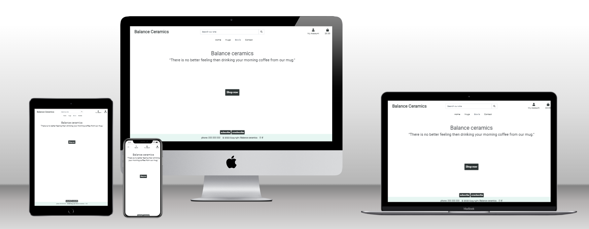
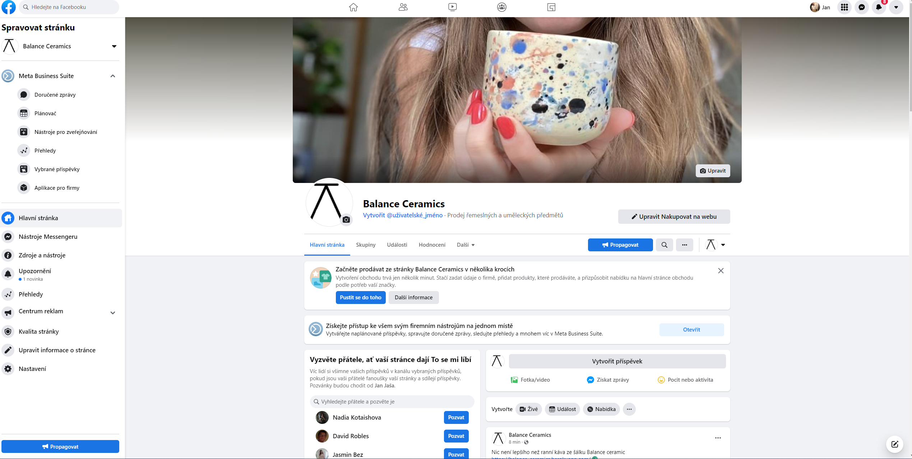
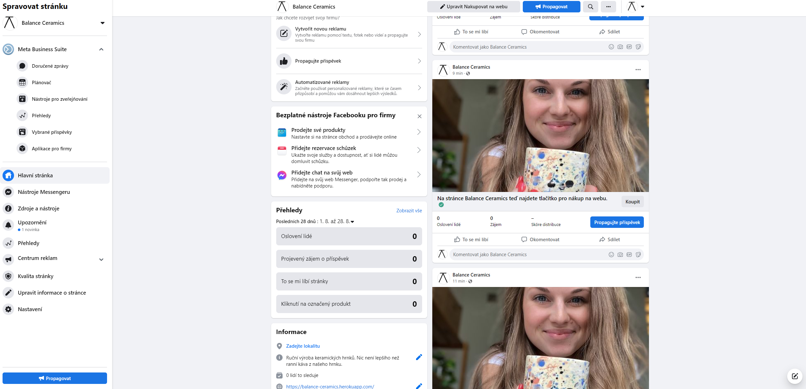
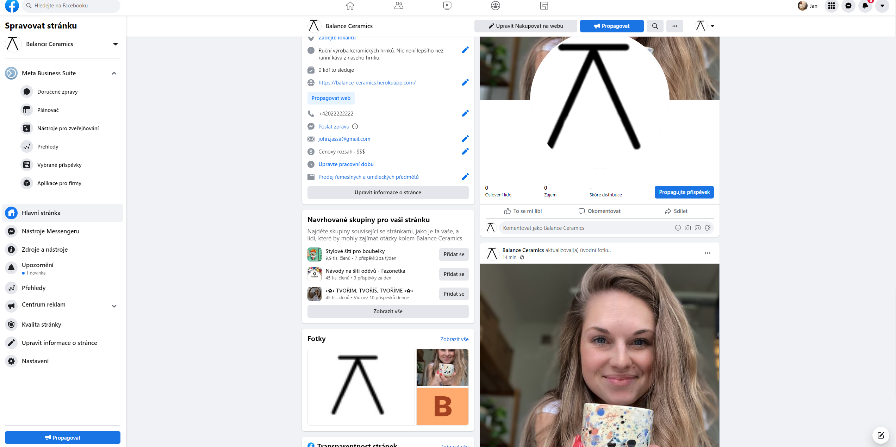
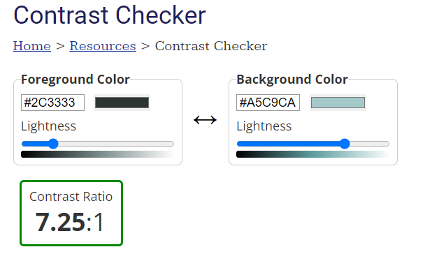
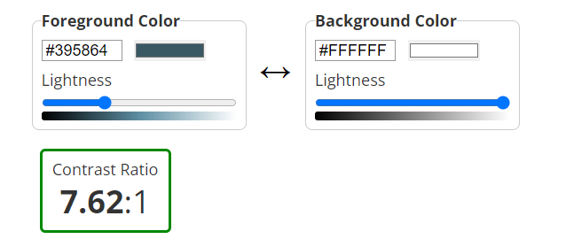

# Balance ceramics
 

\
&nbsp;
Live link can be found here - [link](https://balance-ceramics.herokuapp.com/ "live app")
\

&nbsp;
# Table of Contents
* [Background](#background "Background")
* [Mission Statement](#mission-statement "Mission Statement")
* [Target Audience](#target-audience "Target Audience")
* [Stakeholder Interviews](#stakeholder-interviews "Stakeholder Interviews")
    * [User Persona](#user-persona "User Persona")
    * [User Goals](#user-goals "User Goals")
    * [User Stories](#user-stories "User Stories")
    * [Requirements and Expectations](#requirements-and-expectations)
    * [Strategy](#strategy "Strategy")
        * Strategy Outline
        * Strategy Description
    * [Marketing](#marketing "Marketing")
    * [Wireframes](#wireframes "Wireframes")
    * [Design Choices](#design-choices "Design Choices")
        * Fonts
            * Content
            * Headings
        * Colours
        * Images
    * [Structure](#structure "Structure")
        * Models
        * Forms
    * [Features](#features "Features")
        * Existing Features
        * Features to be implemented
    * [Technologies used](#technologies-used "Technologies used")
        * Languages
        * Libraries, Frameworks and Tools
    * [Testing](#testing "Testing")
        * UX Testing
        * Manual Testing
        * Code Validation
        * Bugs
        * Unfixed Bugs
    * [Deployment](#deployment "Deployment")
        * Local Deployment
        * Deployment via Heroku
    * [Credits](#credits "Credits")


# Background
Balance-ceramics as a shop sells ceramic mugs, plates and bowls. At this point the owner wanted to create ecommerce site only for mugs with the other products coming in later. Product is made in a small workshop. The whole business is owned by one person and all the works is done by the same person as well. So far, the business is run primarily on instagram, with the owner aiming to have an own commerce site.

Customers at this point are primarily friends or relatives, with the aim to widen the audience, therefore the ecommerce site will be able to provide such goal.


# Mission Statement
to create an ecommerce site which would allow widen the customer base and have the ability to increase the income.

# Target Audience
The customers that use balance-ceramics at this point are mostly around the age of 30 years old. The target audience is the customer with higher salary and age over 30 years. 


# Stakeholder Interviews

## User Persona
Interviews were carried out with the owner of Balance-ceramics, customers that currently use the instagram 'shop'.

&nbsp;

| Name | Age | Uses the service |
| -- | -- | -- |
| Tereza Nieserová | 30 | Owner |
| Katerina Novaková | 28 | Yes |
| Tereza Kohoutková | 29 | Yes |
| Jana Knourková | 31 | Yes |

&nbsp;

## User Goals
From the resulting interviews, the user goals have been defined:

1. Create, update and delete products
1. Quickly create orders and securely purchase
1. Login and out functionality
1. View contact details
1. Search through products

&nbsp;

## User Stories

| ID | User Category | User wants to... | So they can... |
|--|--|--|--|
| 01 | Store Owner | Add products | Add new items to the store
| 02 | Store Owner | Edit and update a product | Change the price or any details of a product
| 03 | Store Owner | Delete products | Remove them from the store
| 06 | Shopper | View a list of all the products | Choose products to purchase
| 07 | Shopper | See individual product details | Have a detailed explanation of the product
| 08 | Shopper | Have contact information available | Make contact with the store if there is a problem
| 09 | Shopper | Easily select dishes for purchase | Keep interaction time down 
| 10 | Shopper | See the items selected for purchase | Keep track of my selections
| 11 | Shopper | See a running total of shopping basket | Keep track of their spending
| 12 | Shopper | Select multiple quantities of the same product | Order two of the same product
| 13 | Shopper | Filter the products | Narrow down the products to the ones wanted
| 14 | Shopper | See the number of search results | See the number of results of the search
| 15 | Site User | Easily register for an account | view an individual profile
| 16 | Site User | Easily login and logout | Access personal information
| 17 | Site User | Recover a password if required | Recover access to their account if required
| 18 | Site User | Have payment information saved | Speed up use for regular customers


&nbsp;

## Requirements and Expectations

| Requirement | Expectation
| -- | --
| Visually appealing and well laid out | Colours to be complimentary, text to be clear. Navigation to be logical and simple
| Responsive design (Mobile first) | The screen size to not affect the look of the application 
| Secure payment method | Card details to be secure
| CRUD functionality for products | Easily maintain the store's products
| Search and filter products | Easily refine the product to the user's needs

\
&nbsp;
[Back to Top](#table-of-contents)
\
&nbsp;

# Marketing
Instagram is a primary marketing strategy for Balance Ceramics, with Facebook page created I wasnt allowed an access.
I created a dummy page for the store. link is here [facebook](https://www.facebook.com/Balance-Ceramics-102421489274785)

printscreen are icluded here

- facebook 1
 

- facebook 2


- facebook 3



\
&nbsp;
[Back to Top](#table-of-contents)
\
&nbsp;


# Wireframes
since I ended up using mostly boutique ado project, there is no reason to include wireframes


\
&nbsp;
[Back to Top](#table-of-contents)
\
&nbsp;


## Design Choices

### Fonts

The font chosen by the client selected from Google Fonts.
font-family: 'Roboto', sans-serif;
[link](https://fonts.google.com/specimen/Roboto)

### Colors


#### Color contrast validation






| Hex Value |Text | Button | Background |
| -- | -- | -- | -- |
|#FFFFF|||x|
|#2C3333|x|x||
|#395864||x||
|#A5C9CA||x||
|#E7F6F2|||x|

&nbsp;

All of the desired colour combinations have passed the [WebAIM Contrast Checker](https://webaim.org/resources/contrastchecker/ "WebAIM") and the results can be seen below.


## Models

### mugs

| Name | Key | Type | Other Details
| -- | -- | -- | --
|category| = models.ForeignKey('MugsCategory', null=True, blank=True, on_delete=models.SET_NULL)
|name| = models.CharField(max_length=254|
|image_url| |URLField|max_length=1024, null=True, blank=True|
|image| |ImageField|null = True, blank = True|
|slug_name||SlugField|max_length=255, unique = True|
|price| |DecimalField|max_digits = 6, decimal_places = 2|
\
&nbsp;

### mugscategoory

| Name | Key | Type | Other Details
| -- | -- | -- | --
|name| |CharField|max_length=254|
|friendly_name| |CharField|max_length=254, null=True, blank=True|
\
&nbsp;

### User Profile

| Name | Key | Type | Other Details
| -- | -- | -- | --
UserProfile|User|OnToOneField|on_delete=models.CASCADE|
| default_phone_number | |CharField | max_length=20, null=True, blank=True
|default_postcode||Charfield|max_length=20, null=True, blank=True
|default_town_or_city||Charfield|max_length=40, null=Tru, blank=True|
|default_street_address1||Charfield|max_length=80, null=Tru, blank=True|
|default_street_address2||Charfield|max_length=80, null=Tru, blank=True|


\
&nbsp;

### Order
| Name | Key | Type | Other Details
| -- | -- | -- | --
| order_number |  |  CharField | max_length=32, null=False, editable=False
| user_profile | FK(UserProfile) |  | null=True, blank=True, related_name='orders', on_delete=models.SET_NULL
| full_name |  | CharField | max_length=50, null=False, blank=False
| email |  | DecimalField | max_length=254, null=False, blank=False
| phone_number | | CharField | max_length=20, null=False, blank=False
|default_postcode||Charfield|max_length=20, null=True, blank=True
|default_town_or_city||Charfield|max_length=40, null=Tru, blank=True
|default_street_address1||Charfield|max_length=80, null=Tru, blank=True
|default_street_address2||Charfield|max_length=80, null=Tru, blank=True
| date | | DateTimeField | auto_now_add=True
| order_total | | DecimalField | max_digits=10, decimal_places=2, null=False, default=0
| grand_total | | DecimalField | max_digits=10, decimal_places=2, null=False, default=0
| original_bag | | TextField | null=False, blank=False, default=''
| stripe_pid | | CharField | null=False, blank=False, default=''


### NewsletterUsers
| Name | Key | Type | Other Details
| -- | -- | -- | --
| email |  | DecimalField | max_length=254, null=True, blank=True
|date_added||DateTimeField|auto_now_add=True|


### Newsletter
| Name | Key | Type | Other Details
| -- | -- | -- | --
|title| |CharField|max_length=100, null=True, blank=True
|message| |TextField|null=True, blank=True

### MailMessage
| Name | Key | Type | Other Details
| -- | -- | -- | --
|subject |CharField(max_length=255)
|body || TextField()
|email||ManyToManyField|NewsletterUsers
|status||CharField|max_length=10, choices=EMAIL_STATUS_CHOICES
|create||DateTimeField|auto_now_add=True
|updated||ĐateTimeField|auto_now=True|


### Forms


\
&nbsp;
[Back to Top](#table-of-contents)
\
&nbsp;

# Features

I decided not to include features from the whole shop, since most of it ws created during boutique ado project. I am including all fetures created by me in newsletters and control panel section. Of course testures from footer and contacts sections.

## Existing Features

### Navbar

The navigation bar is fully responsive to all screen sizes. it includes a search bar that searches the menu and the user's session basket total. The basic view is if a user is not logged in, then there are other differences depending on the user's login access:

- The user is logged in as admin


### Footer


### control panel

-control panel without newsletters


- control panel with newsletters


- compose a new letter


- edit/send  drafted letter


- delete created newsletter


- edit btn in control panel


-delete btn in control panel


- sub/ unsub form for newsletters


-back to shop button feturing in whole control panel section


### contacts

-accordion with fucts in a contacts section


## Features to be Implemented
There are a few ideas that I would like to implement in the future:
* Login via social media account or Google.
* Customisable email with images and style instead of plain text.
* Ability to  add a profile picture.
* Customer feedback section with the ability to reply by admin.
* Ability for the admin to see a list of all the users and adjust their access rights if required.

\
&nbsp;
[Back to Top](#table-of-contents)
\
&nbsp;


# Technologies used

## Languages

| Languages | Link |
|--|--|
|HTML|[HTML](https://en.wikipedia.org/wiki/HTML5 "HTML") 
|CSS|[CSS](https://en.wikipedia.org/wiki/CSS "CSS")
|JavaScript|[JavaScript](https://en.wikipedia.org/wiki/JavaScript "JS")
|jQuery|[jQuery](https://jquery.com/ "jQuery")
|Python|[Python](https://en.wikipedia.org/wiki/Python_(programming_language) "Python")
|Markdown|[Markdown](https://en.wikipedia.org/wiki/Markdown)


## Libraries, Frameworks and Tools
| Libraries / Frameworks / Tools| Description | Link |
|--|--|--|
|Django|Database Driven Framework| [django](https://en.wikipedia.org/wiki/Django_(web_framework) "django")|
|gunicorn|HTTP Interface Server|[gunicorn](https://en.wikipedia.org/wiki/Gunicorn "gunicorn")|
|psycopg2| Database adaptor | [psycopg2](https://wiki.postgresql.org/wiki/Psycopg "psycogg2")
| AWS |Image static management|[cloudinary](https://aws.amazon.com/ "AWS")|
|django auth|User authentication|[auth](https://docs.djangoproject.com/en/3.2/topics/auth/ "auth")|
| django crispy forms | Styling forms | [crispy-forms](https://django-crispy-forms.readthedocs.io/en/latest/ "crispy-forms")
|Sitemap Generator| Generating the site map|[xml-sitemaps](https://www.xml-sitemaps.com/ "XML-Sitemaps.com")
|HTML Validation| Validating HTML|[w3.org](https://validator.w3.org/ "W3C")
|CSS Validation| Validating CSS|[w3.org](https://jigsaw.w3.org/css-validator/ "W3C")
|PEP8|Validating python|[PEP8](http://pep8online.com/ "PEP8")
| GitPod | Development environment |[Gitpod](https://www.gitpod.io/ "Gitpod")
| Balsamic | Wireframes |[Balsamic](https://balsamiq.com/wireframes/ "Balsamic")
| Bootstrap | Responsive design |[Bootstrap](https://getbootstrap.com "Bootstrap")
| Font Awesome | Icons |[Font Awesome library](https://fontawesome.com/ "Font Awesome")
| miniwebtool | Secret Key |[Secret Key Generator](https://miniwebtool.com/django-secret-key-generator/ "miniwebtool")
| Colours|Colour pallet| [coolors](https://coolors.co/ "coolors")|
| Google Fonts| Fonts |[Google Fonts](https://fonts.google.com/ "Fonts")|
| WebAIM| Colour contrast checks |[WebAIM](https://webaim.org/resources/contrastchecker/ "WebAIM")|
|Stripe| online payments| [Stripe](https://stripe.com/en-gb "Stripe")


# Testing

\
&nbsp;

\
&nbsp;
[Back to Top](#table-of-contents)
\
&nbsp;

## Automated Testing
This is the part of creating the application, I have found hard to get my head around. I have spent a lot of time reading the [django docs](https://docs.djangoproject.com/en/4.0/topics/testing/ "docs") but unfortunately, I can admit I have a very long way to go until I'm comfortable creating these.


\
&nbsp;
[Back to Top](#table-of-contents)
\
&nbsp;

## Manual Testing

| Issue Number |  Title | Comments 
|--|--|--|
|1|newsletter details|ended up not using this template because it didnt provide anything extra to the user|
|2|links-back to shop|changed color on hover to match the site|
|3|labels|hid labels on subscibe and unsubscribe form to make them look cleaner|
|4|subscribe, unsubscribe forms|moved them form the site to a clean page, becuase of being covered under footer on small screens- but this created another issue - they get squeezed ons mall screens|
|5|edit buttons in newsletters list| had to change their color because of contrast issue|
|6|control panel link|added control panel in a dropdown menu when user is admin|
|7|sub / unsub forms|ended up putting them as a parf of web|


### HTML
| File Name | File Path | Result | W3C | Comments |
|--|--|--|--|--|


### CSS
| File Name | Link | Result | Comments |
|--|--|--|--|
|allauthcss|[link](static/media/images/readmedocs/allauthcss.png "link")|ok||
|bagcss|[link](static/media/images/readmedocs/bagcss.png)|ok||
|basecss|[link](static/media/images/readmedocs/base.css.png)|ok||
|contactscss|[link](static/media/images/readmedocs/contactscss.png)|ok||
|control_panelcss|[link](static/media/images/readmedocs/control_panelcss.png)|ok||
|homecss|[link](static/media/images/readmedocs/homecss.png)|ok||
|checkoutcss|[link](static/media/images/readmedocs/checkoutcss.png)|ok||
|newsletercss|[link](static/media/images/readmedocs/newslettercss.png)|ok||
|productsscss|[link](static/media/images/readmedocs/productscss.png)|ok||
|profilecss|[link](static/media/images/readmedocs/profile.css.png)|ok||


### Python
| File Name | link | Result | Comments |
|--|--|--|--|
|pep8bagcontexts|[link](static/media/images/readmedocs/pep8 bag contexts.png)|PASS||
|pep8bagurls|[link](static/media/images/readmedocs/pep8 bag urls.png)|PASS||
|pep8bagviews|[link](static/media/images/readmedocs/pep8 bag views.png)|PASS||
|pep8controlpanelurls|[link](static/media/images/readmedocs/pep8 control panel urls.png)|PASS||
|pep8homeurls|[link](static/media/images/readmedocs/pep8 home urls.png)|PASS||
|pep8homeviews|[link](static/media/images/readmedocs/pep8 home views.png)|PASS||
|pep8checkoutforms|[link](static/media/images/readmedocs/pep8 checkout forms.png)PASS||
|pep8checkoutmodels|[link](static/media/images/readmedocs/pep8 checkout models.png)|PASS||
|pep8checkoutsignals|[link](static/media/images/readmedocs/pep8 checkout signals.png)|PASS||
|pep8checkouturls|[link](static/media/images/readmedocs/pep8 checkout urls.png)|PASSS||
|pep8checkoutviews|[link](static/media/images/readmedocs/pep8 checkout views.png)|PASS||
|pep8checkouturls|[link](static/media/images/readmedocs/pep8 checkout urls.png)|PASS||
|pep8newsletterforms|[link](static/media/images/readmedocs/pep8 newsletters forms.png)|PASS||
|pep8newslettermodels|[link](static/media/images/readmedocs/pep8 newsletters models.png)|PASS||
|pep8newslettersviews|[link](static/media/images/readmedocs/pep8 newsletters views.png)|3warnings|line too long coulndt be whorten without braking the syntax of a code, indentation - coulndt fint the right spot even aftert many tries|
|pep8productsadmin|[link](static/media/images/readmedocs/pep8 products admin.png)|PASS||
|pep8productsforms|[link](static/media/images/readmedocs/pep8 products forms.png)|PASS||
|pep8productsmodels|[link](static/media/images/readmedocs/pep8 products models.png)|PASS||
|pep8productsurls|[link](static/media/images/readmedocs/pep8 products urls.png)|PASS||
|pep8productsviews|[link](static/media/images/readmedocs/pep8 products views.png)|2warnings| aven after deleting white space couple of times, it stil came back every time|
|pep8productswidgets|[link](static/media/images/readmedocs/pep8 products widgets.png)|1warning|couldnt shorten becaquse of a syntax|
|pep8pprofilemodels|[link](static/media/images/readmedocs/pep8 profile models.png)|PASS||
|pep8profileurls|[link](static/media/images/readmedocs/pep8 profile urls.png)|PASS||
|pep8profileforms|[link](static/media/images/readmedocs/pep8 profile forms.png)|PASS||
|pep8webhookhandler|[link](static/media/images/readmedocs/pep8 webhook handler.png)|3 warnings|couldnt shorten lines because of a syntax|
|pep8webhooks|[link](static/media/images/readmedocs/pep8 webhooks.png)|PASS||


## Bugs
| Issue Number |  Title | Comments 
|--|--|--|
|1|Newsletter edit message|system sends message on opening the form not on submiting it|
|2|newsletter list|on small screens doesnt fit the site|
|3|navbar|when on a contacts page, navbar is not 100% and has different color|
|4|photo upload|when adding a product to a page thru product management - picture doesnt upload correctly - can be added thru edit screen and works fine then|
|5|Profile -name|in a profile app isnt stored a name of the user|


# Deployment

This project was created using GitHub and the code was written using Gitpod. Branches were created and after committing to the branch it was pushed up to the repository. This project is also deployed to Heroku, during its early stages, Heroku deployment was set to *Enable Automatic Deploys*, which meant that every time that the repository was pushed to, Heroku was updated also. However, Heroku encountered a security issue so automatic deployments were no longer available so the following deployment procedure was followed in the workspace terminal.

```
heroku login -i

Email: __enter_heroku_account_email__
Password: __enter_heroku_account_password__

heroku git:remote -a __your _heroku_app_name__

git push heroku main
```


## Local Deployment

As Gitpod was the IDE that was used to create the project, the following local deployment steps are specific to Gitpod.

### Set up your Workspace
When you have your version of the original repository,

* In the terminal run
```
pip3 install -r requirements.txt

```
import os

```

* Add the env.py file to the .gitignore file to ensure that its contents are not made public

* Migrate the database models with the following command in the terminal
```
python3 manage.py migrate
```

* Create a superuser and set up the credentials with the following command
```
python3 manage.py createsuperuser
```

* Run the application locally with the command
```
python3 manage.py runserver
```

* To access the admin page using the superuser details just created, add /admin to the end of the URL.


### Deployment via Heroku
* Visit [heroku.com](https://www.heroku.com/home "Heroku")
* Create a new account or sign in
* From the dashboard, select **New** and then **Create new app**
* Enter an individual app name into the text box, select a region from the dropdown and then press **Create app**
* A Heroku app has now been created and the **Deploy** tab is opened. 
* Open the *Resources* tab and in the search bar for *Add-ons* type *Postgres*
* Select *Heroku Postgres*, on the popup, ensure the dropdown is set to *Hobby Dev - Free* and then *Submit Order Form*
* Open the *Settings* tab and then click on the *Reveal Config Vars* button and the database_url should be populated.
* Fill out the rest of the config vars with the content of the table below by filling out the *Key* and *Value* and clicking on *Add* for each entry 

| Key | Value |
| --- | --- |
| SECRET_KEY | Secret Key generated from [here](https://miniwebtool.com/django-secret-key-generator/ "Shhh...")
| EMAIL_HOST_PASS | Password from Gmail authentication setup
| EMAIL_HOST_USER | Gmail account that will be used
| STRIPE_PUBLIC_KEY | From the stripe section
| STRIPE_SECRET_KEY | From the stripe section
| STRIPE_WH_SECRET | From the stripe section

* In the buildpacks section of the settings tab, click on **Add Buildpack**, select **python** and then save changes
* Open the **Deploy** tab
* In the deployment method section, select **GitHub** and confirm the connection.
* Enter the repo name into the text box and click **Search**. When the correct repo appears below, click **Connect**
* Return to the Gitpod workspace and in the root directory create a file called *Procfile*
* In the *Procfile* enter the following line including your project name
```
web: gunicorn YOUR_PROJECT_NAME.wsgi
```
* Add and commit to GitHub
```
git add .
git commit -m "commit message goes here"
git push
```
* Add your Heroku app URL to ALLOWED_HOSTS in your settings.py file
```py
ALLOWED_HOSTS = ['YOUR_PROJECT_NAME.herokuapp.com', 'localhost']
```
* Return to Heroku
* In the Automatic deploys section, click **Enable Automatic Deploys**. This updates every time GitHub code is pushed
* To complete the process click on the **Deploy Brach** button in the Manual deploy section, this will take a few seconds to complete while Heroku builds the app
* A message will appear informing you that the app was successfully deployed and a **View** button will bring you to the live site


### Stripe
* Visit Stripe by following this [link](https://dashboard.stripe.com/register "Stirpe")
* And register for an account, for this project as it is only set up for test payments the *activate payments* section can be skipped.
* From the dashboard, click on the *Developers* and then on the lefthand side, *Webhooks*.
* Click on the *Add endpoint button* and paste in the Heroku URL with `/checkout/wh/`
* Add an optional description if required
* Click the *Select events* button and mark the checkbox for *Select all events*, then click *
Add events*.
* Scroll to the very bottom of the page and then click *Add endpoint*
* From the webhook page under the URL, reveal the Signing secret, this will need to be added to Heroku config vars as STRIPE_WH_SECRET.
* Still in the developer's section of Stripe, click on the *API keys* link on the left, the *Publishable key* (STRIPE_PUBLIC_KEY) and *Secret key* (STRIPE_SECRET_KEY) will also be needed to be added to Heroku config vars.

### Email setup
This project is using Gmail as its email provider. Other providers can be used but the setup will differ slightly.

* Create a Gmail account, or log in if you already have an account
* At the top right waffle menu select *Account*, then on the left of the screen select *Security*
* In the *Signing into Google* section turn on 2-step verification and then click *Get started*
* Enter your password and select a verification method
* Go back to the security page and under the 2-step verification there is a new option called *App passwords*, click it.
* In the select app dropdown, select *Mail*
* In the select device dropdown, select *Other* and type in *Django*
* The app password will be shown, copy this and add it to the Heroku config vars as EMAIL_HOST_PASS.


\
&nbsp;
[Back to Top](#table-of-contents)
\
&nbsp;

# Credits
 [Code Institute](https://codeinstitute.net/all-access-coding-challenge/?gclsrc=aw.ds&&msclkid=1915e48bf28d11888d1785dfd2b04125&utm_source=bing&utm_medium=cpc&utm_campaign=a%26c_SEA_IRL_BR_Brand_Code_Institute&utm_term=code%20institute&utm_content=exa_Brand "CI") for the template
* [Code Institute's Boutique Ado](https://github.com/Code-Institute-Solutions/boutique_ado_v1/) for Stripe payments and guidance
* [Simen Daehlin](https://github.com/Eventyret "Simen Daehlin") for advice and direction and continual support
* [Codemy.com](https://www.youtube.com/channel/UCFB0dxMudkws1q8w5NJEAmw "Codemy.com") for help on Django

\
&nbsp;
[Back to Top](#table-of-contents)
\
&nbsp;


